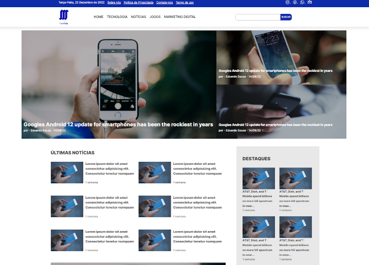

# Site de Notícias de Tecnologia

Este repositório contém um projeto de um site de notícias de tecnologia desenvolvido utilizando HTML, CSS e JavaScript. O objetivo deste projeto é testar e aprimorar meus conhecimentos nessas tecnologias, proporcionando uma experiência de navegação intuitiva para os usuários interessados em notícias relacionadas à tecnologia.

<a href="https://tech-fala-news.netlify.app">Link</a>
- Está em desenvolvimento

## Funcionalidades

- **Exibição de Notícias:** O site apresenta seções diferentes para exibir notícias de tecnologia em destaque, últimas notícias e por categorias.
- **Detalhes da Notícia:** Os usuários podem clicar nas notícias para visualizar os detalhes, incluindo título, data, resumo e imagem relacionada.
- **Responsividade:** O layout do site foi desenvolvido para ser responsivo, adaptando-se a diferentes tamanhos de tela e dispositivos.

## Tecnologias Utilizadas

- HTML5
- CSS3
- JavaScript

## Como Usar

1. Faça um clone deste repositório em sua máquina local.
2. Abra o arquivo `index.html` em seu navegador web.
3. Navegue pelas diferentes seções do site para explorar as notícias disponíveis.
4. Clique em uma notícia para visualizar seus detalhes.
5. Utilize a barra de pesquisa para encontrar notícias específicas.

## Contribuição

Contribuições são bem-vindas! Se você tiver sugestões de melhorias, correções ou novas funcionalidades para o site, sinta-se à vontade para abrir uma issue ou enviar um pull request.

